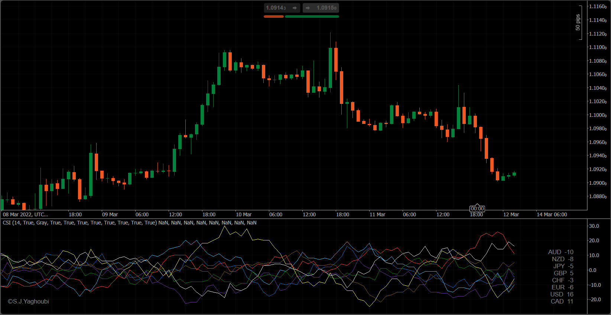

# CSI (Currency Strength Index)

The currency strength index is one of the useful indicators that help us to evaluate the market sentiment and determine the direction of Liquidity flow.     

Overbought/Oversold, Convergence and Divergence, Money flow direction, and Curves-cross are some of the famous information that CSI provides for traders.  

Be aware that there is not a single method to calculate currency strength, So you may see some differences between the various versions of CSI's.    

Our approach in this tool is looking at 28 different pairs and calculating the strenght of 8 major currencies through calculating the ratio of bodies to the length of candles over the special periods:     
(Close - Open) / (High - Low) over a special period  

In this tool, you can choose which currency you want to be reported. The colors are adjustable and the report is based on the current chart timeframe.

# Installation:
Just copy the indicator(CSI.algo) from Compiled Directory to your PC and double-click on it. It will install automatically on your Ctrader-Platform. You can also download it directly from the Ctrader network:

Ctrader Developer Network    

